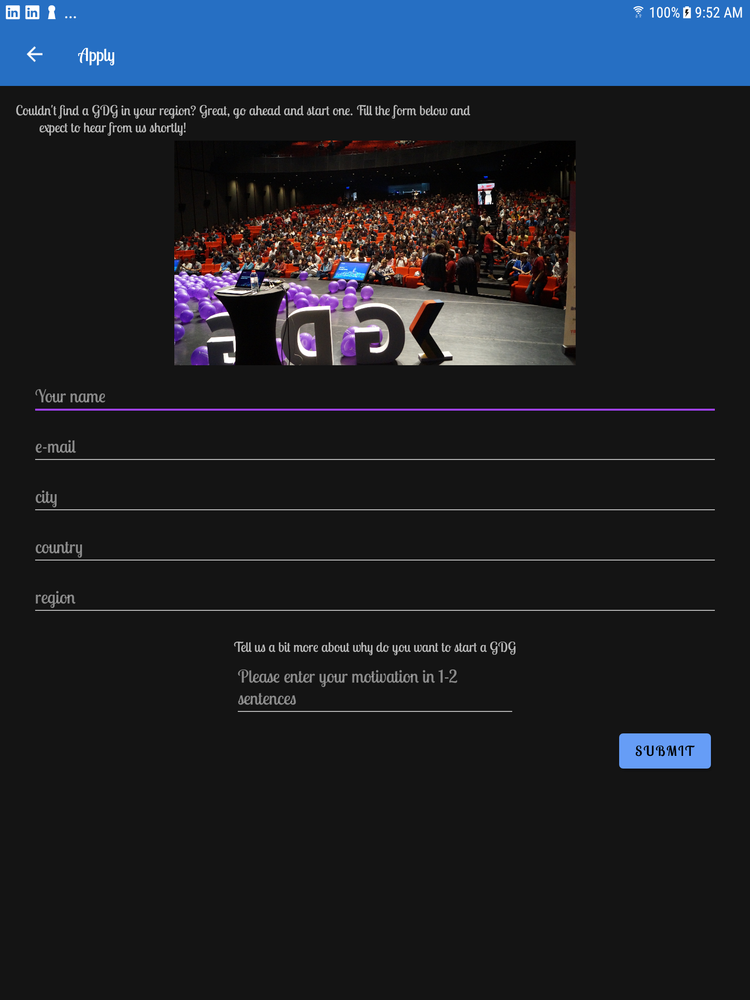

# Designing for Everyone - GDG Finder app

This app is a programming exercise focusing on using Material Design and integraing accessiblity functionality.
## GDG Finder

GDGs, or Google Developer Groups, are communities of developers that focus on Google technologies - including Android - around the world. They host lots of different events like meetups, conferences, study jams, and more!

GDG Finder helps you locate GDGs around the world or start one of your own. 
 
## Screenshots

